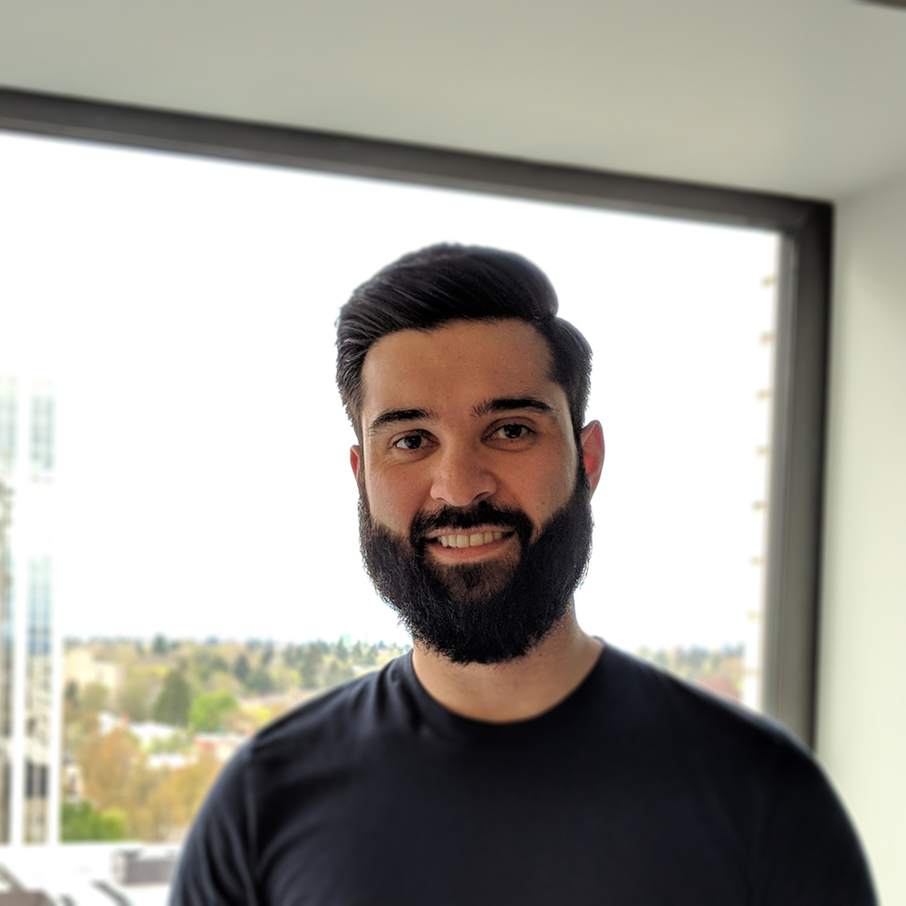

 

  

    
Aaron is a National Library of Medicine Pre-doctoral Fellow studying Bioinformatics and Computational Biomedicine [PhD Candidate](https://www.ohsu.edu/xd/education/schools/school-of-medicine/departments/clinical-departments/dmice/people/Aaron-Coyner.cfm) at Oregon Health & Science University (OHSU). He works closely with the [i-ROP Consortium](http://i-rop.github.io/index.html) studying retinopathy of prematurity. His dissertation work centers around the implementation and use of machine learning algorithms, specifically deep learning, for retinal fundus image quality assessment and abnormal pathological findings for telemedicine applications.

Prior to beginning his PhD, he received his Bachelor of Science in Biochemistry from [Pacific Lutheran University](https://www.plu.edu/chemistry/) in Tacoma, WA. During his undergraduate career, he volunteered with Guide Dogs for the Blind and raised two guide dog puppies. Naturally, this developed into an affinity for the visually-impaired community and a desire to use his undergraduate degree to make an impact within. Following graduation, he sought out a job as a research assistant in an ophthalmic genetics lab at the [Casey Eye Institute](https://www.ohsu.edu/xd/health/services/casey-eye/) at OHSU. However, after two years of mouse and wet-lab work, he learned that he much preferred working with data and performing analyses. This led Aaron to the Bioinformatics and Computational Biomedicine program at OHSU.

In addition, Aaron is a teaching assistant for both the PHPM 524: Introduction to Biostatistics and [MATH 630: Probability & Statistical Inference for Scientists and Engineers](https://ohsu-math630-fall-2018.netlify.com/) at OHSU. 

When not studying, running stats, coding, read/writing papers, or teaching, Aaron can usually be found doing the stereotypical "Portlandian" activities: enjoying an IPA with his partner, Jessica, at the dog park with his dog, Zoey, or riding around on his motorcycle, a Triumph Tiger, exploring the Pacific Northwest.
  
  

  

  

